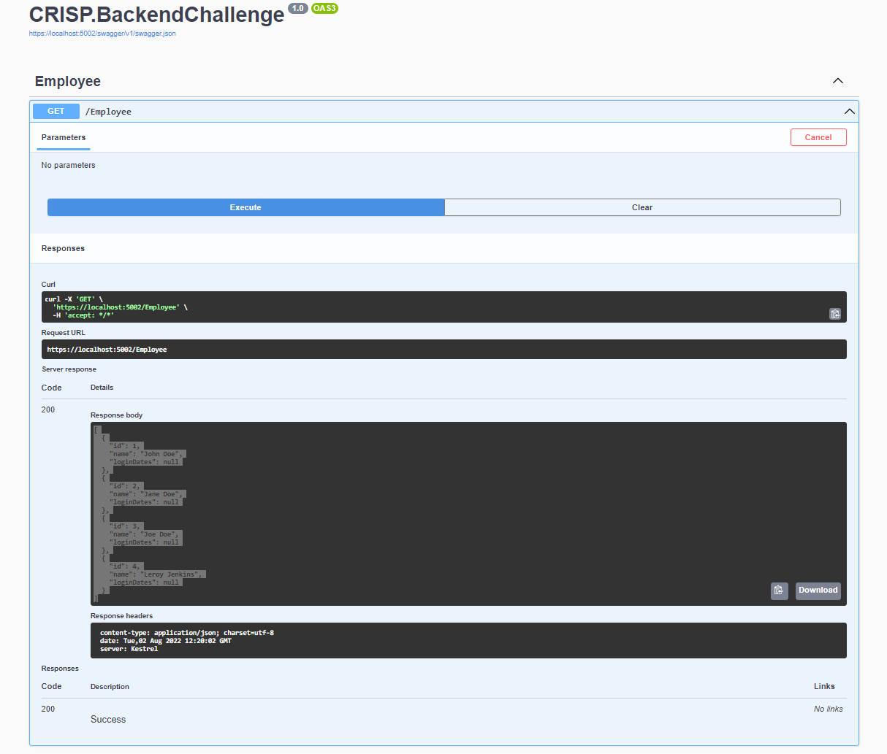

# CRISP backend code challenge

## Prerequisites

You will need to have git and [dotnet 6 SDK installed](https://dotnet.microsoft.com/en-us/download/dotnet/6.0).
And ensure that you have an appropriate environment to run on. For example, [VSCode2022](https://visualstudio.microsoft.com/vs/), visual studio code, or Rider.


Note that this code will only run on net6 specifically. Ensure you are not using an older version of dotnet core (2.1, 3.1, 5.0, etc)

## Background 
The purpose of this challenge is to demonstrate one's ability to code up a REST API. The web-application is a simple Model-Controller API that currents returns a list of all 
the available employees. The task here is to build up this new API to include CRUD and a search functionality. There are two tables that which their schema is defined in the SQL below.

### Notes:
This exercise should take no more than 3 hours but feel free to invest as much time as required to complete the challenge.


```cmd
dotnet run src/CRISP.BackendChallenge
```
from the project root. 

Or Feel free to use any IDE you are comfortable using to run the server.

Test out the server to make sure it works and think about how you might want to solve the questions below.

```curl
curl -X 'GET' \
  'https://localhost:YOURPORT/Employee' \
  -H 'accept: */*'
```
or generally:
```http
GET /Employee HTTP/1.1
Host: localhost:YOURPORT
```

should return:
```json
[
  {
    "id": 1,
    "name": "John Doe",
    "loginDates": null
  },
  {
    "id": 2,
    "name": "Jane Doe",
    "loginDates": null
  },
  {
    "id": 3,
    "name": "Joe Doe",
    "loginDates": null
  },
  {
    "id": 4,
    "name": "Leroy Jenkins",
    "loginDates": null
  }
]
```

You may access the swagger endpoint: https://localhost:YOURPORT/swagger/index.html to explore the existing API.
**Example Of Swagger Page:**


*NOTE*: The port may be different than 7221 depending on how you run the server.


Note that we are using Entity Framework as an ORM for this scaffold and that the underlying database in sqlite. The database should be seeded with data on initialization of 
the context.

## Tables
There are two tables in the database `Employee` and `Login`
The sql statement below defines the schema for the two tables (note the relationship):

```sql
```sql
create table Employees
(
    Id         INTEGER not null
        constraint PK_Employees
            primary key autoincrement,
    Name       TEXT    not null,
    Department INTEGER not null
);

create table Logins
(
    Id         INTEGER not null
        constraint PK_Logins
            primary key autoincrement,
    EmployeeId INTEGER not null
        constraint FK_Logins_Employees_EmployeeId
            references Employees
            on delete cascade,
    LoginDate  TEXT    not null
);

create index IX_Logins_EmployeeId
    on Logins (EmployeeId);
```

The `Logins` table tracks all of the logins for the people in person.

## Tasks

1. Fork the reposistory
2. Complete the tasks as defined below
3. Issue a Pull Request From YOUR fork to our Main branch for evaluation

### Task Details
We already have code for to retrieve all employees as an example with an example to build upon.

Implement The Following For The Employee Controller:
  - Get By Id
  - Create
  - Update by Id
  - Delete by Id
  - Search
    - id
    - name
    - department
    - behavior to include all logins for the employee
    - Sort Order On Login Dates (latest first)

The API should follow general RESTful conventions.


- Implement Unit Test For in the `test\CRISP.BackendChallenge.Tests` folder (if time permits)

## Things We Are Looking For:
1. Ability to understand/constrain the problem
2. Well organized clean code
3. Thoughtful REST endpoints
4. Ability to isolate and debug problems as they arise
5. Familiarity with C#, dotnet, and comfort working within an existing repo
6. Familiarity and comfort writing tests
